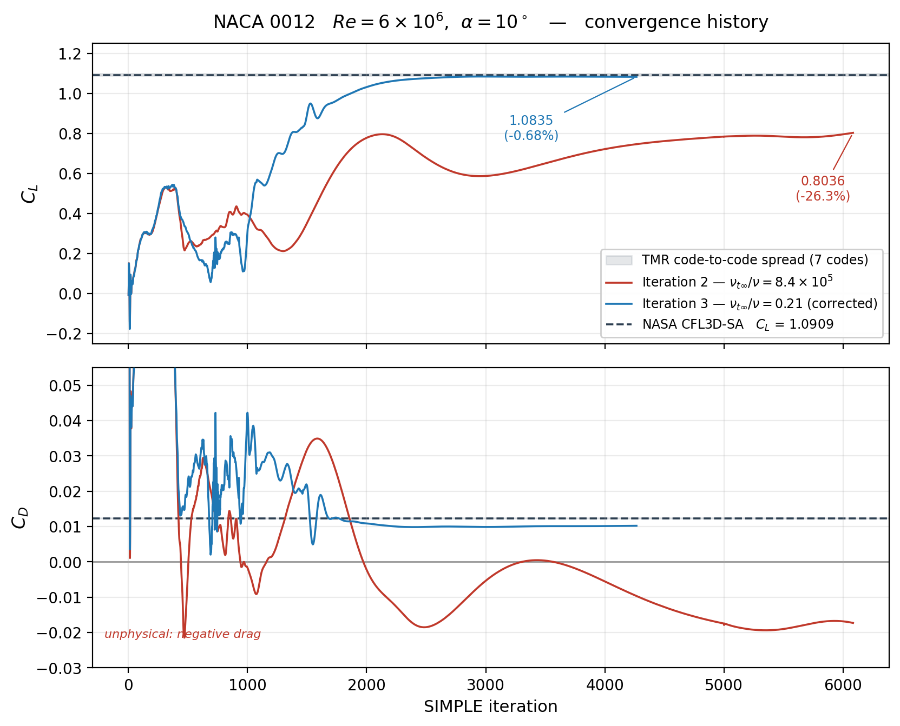
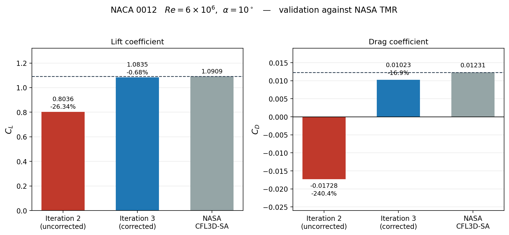

# NACA 0012: 2D RANS Validation against the NASA Turbulence Modeling Resource

> **Status:** Validated. alpha = 10 deg, Re = 6 x 10^6, Spalart-Allmaras.
> **C_L = 1.0835** against the CFL3D-SA reference of 1.0909 — **-0.68%**, inside the spread of the seven TMR reference codes.

---

## Result

| Case | C_L | error | C_D | error |
|---|---|---|---|---|
| NASA CFL3D-SA (reference) | 1.0909 | — | 0.01231 | — |
| Iteration 2 (superseded) | 0.8036 | -26.3% | -0.01728 | — |
| **Iteration 3 (validated)** | **1.0835** | **-0.68%** | **0.01023** | **-16.9%** |

C_m,pitch about the quarter chord = 0.0059, correctly near zero for a symmetric section.





The remaining C_D gap is discussed under [Drag](#the-drag-gap) below.

---

## Mesh

NASA TMR **897 x 257** structured C-grid — the standard validation grid used by all seven reference codes on the TMR results page.

| Parameter | Value |
|---|---|
| Source | `n0012_897-257.p2dfmt` (formatted 2D PLOT3D) |
| Cells | 229,376 (100% hexahedra) |
| Surface points on airfoil | 513 |
| Farfield distance | ~500 chords |
| Max non-orthogonality | 19.83 deg (average 1.64) |
| Max skewness | 0.20 |
| **y+ on airfoil** | **min 0.005, max 0.298, average 0.117** |

The measured y+ sits inside NASA's stated design range of 0.1–0.2 for this grid, confirming the mesh is correctly scaled. `checkMesh` flags the max aspect ratio (3.18 x 10^7) as a failed check — this is the wall-normal clustering required for y+ < 1 and is not an error.


*Full domain, farfield at ~500 chords.*


*C-grid topology around the airfoil.*


*Leading edge boundary-layer clustering.*


*Trailing edge, sharp TE preserved.*

### PLOT3D to OpenFOAM

OpenFOAM has no converter for the TMR 2D PLOT3D format. `tools/plot3d_to_msh.py` handles it:

1. Reads the formatted 2D PLOT3D file (230,529 raw nodes)
2. **Deduplicates the C-mesh wake-cut nodes** — 193 merged (192 wake pairs plus the shared trailing-edge point). Without this the wake cut becomes a wall instead of an internal interface.
3. Extrudes to a single-cell-thick slab (z = 0.1)
4. Assigns physical groups matching the OpenFOAM patch names
5. Writes Gmsh `.msh` v2.2 for `gmshToFoam`

`gmshToFoam` writes every patch as generic `patch`, so two types need correcting afterwards — `frontAndBack` to `empty`, `walls` to `wall`. Both are automated in `iteration3_validated/Allrun`.

---

## Case setup

| Parameter | Value |
|---|---|
| Reynolds number | 6 x 10^6 |
| Freestream velocity | 1.0 (non-dimensional) |
| Kinematic viscosity nu | 1.6666667 x 10^-7 |
| Angle of attack | 10.0 deg |
| Freestream U | (0.98481, 0.17365, 0) |
| Lift / drag direction | (-0.17365, 0.98481, 0) / (0.98481, 0.17365, 0) |
| Reference area A_ref | 0.1 (chord x span) |
| Moment reference | (0.25, 0, 0), quarter chord |
| Turbulence model | Spalart-Allmaras |
| Freestream nuTilda | 5 x 10^-7 (= 3 nu, per TMR) |
| Freestream nu_t | 3.51 x 10^-8 (= nuTilda x f_v1) |
| Solver | `simpleFoam`, SIMPLEC |
| Initialisation | `potentialFoam` |
| Converged at | 4266 iterations |

### Boundary conditions

| Patch | U | p | nuTilda | nut | Faces |
|---|---|---|---|---|---|
| inlet | freestreamVelocity | freestreamPressure | freestream | calculated | 896 |
| outlet | freestreamVelocity | freestreamPressure | freestream | calculated | 512 |
| walls | noSlip | zeroGradient | fixedValue 0 | nutUSpaldingWallFunction | 512 |
| frontAndBack | empty | empty | empty | empty | 458,752 |

The `freestream*` family suits a C-grid in external aerodynamics: any farfield face can be inflow or outflow depending on local velocity direction, which varies around the C as incidence changes.

### Numerics

```
div(phi,U)        bounded Gauss linearUpwind grad(U)
div(phi,nuTilda)  bounded Gauss upwind
laplacian         Gauss linear corrected
wallDist          meshWave

SIMPLE            consistent yes  (SIMPLEC)
relaxation        p 1.0   U 0.9   nuTilda 0.7
residualControl   1e-5 on p, U, nuTilda
```

### Angle of attack

The C-grid works at any incidence. Angle of attack is set by rotating the freestream vector, not the mesh:

```
U_inf   = ( cos a,  sin a, 0)
dragDir = ( cos a,  sin a, 0)
liftDir = (-sin a,  cos a, 0)
```

One mesh, many angles.

---

## The drag gap

C_D = 0.01023 against 0.01231 is -16.9%, and is not claimed as validated. Three likely contributors:

1. **Compressibility.** The TMR reference codes ran compressible at M = 0.15; `simpleFoam` is strictly incompressible.
2. **Farfield vortex correction.** The CFL3D reference data uses a point-vortex farfield correction; none is applied here.
3. **Discretisation.** `linearUpwind` momentum and `upwind` nuTilda are more dissipative than the reference schemes.

For proportion: lift is a pressure integral dominated by the suction peak, which this mesh resolves well. Drag is a small difference between larger quantities — the seven reference codes agree to ~1% on C_L but disagree by ~4% among themselves on C_D.

Pressure/viscous split at convergence:

```
             Total       Pressure    Viscous
C_D:        0.010233    0.004033    0.006200
C_L:        1.083529    1.083427    0.000102
```

Skin friction slightly exceeding pressure drag is the expected balance for an attached turbulent boundary layer at this Reynolds number.

---

## Iterations

| | Mesh | alpha | Result |
|---|---|---|---|
| **1** | Custom Gmsh C-mesh, 13.5c farfield | 0 deg | C_L ~ 0.019 (should be 0) — farfield too close |
| **2** | NASA 897 x 257 | 10 deg | C_L = 0.804, C_D = -0.017 — incorrect setup |
| **3** | NASA 897 x 257 | 10 deg | **C_L = 1.0835, C_D = 0.01023 — validated** |

### What was wrong in Iteration 2

`0/nut` was inherited from OpenFOAM's `airFoil2D` tutorial and never rescaled. The tutorial runs at nu = 1e-5; this case runs at nu = 1.6667e-7, so the same literal value of `0.14` meant a freestream eddy viscosity ratio of **8.4 x 10^5** instead of the correct **0.21**:

```
chi   = nuTilda_inf / nu = 5e-7 / 1.6667e-7 = 3.0
f_v1  = chi^3 / (chi^3 + 7.1^3) = 0.0701
nu_t  = 5e-7 x 0.0701 = 3.51e-8        ->  nu_t/nu = 0.21
```

The freestream should be effectively laminar — the boundary layer generates its own turbulence. Instead it was fed 840,000x molecular mixing, held there by the `freestream` BC, which flattened the suction peak and destroyed circulation. Negative C_D was the diagnostic signal: a 26% lift error can come from model or mesh inaccuracy, but net thrust means the momentum balance is broken.

A second error compounded it: SIMPLEC was running with SIMPLE-appropriate relaxation (p = 0.3), which slowed convergence by roughly an order of magnitude.

Correcting both moved C_L from -26.3% to -0.68% with no change to the turbulence model.

**Correction to a previous version of this README:** the Iteration 2 gap was originally attributed to the ft2 trip term (OpenFOAM's `SpalartAllmaras` includes it; NASA's TMR reference uses SA-noft2), and described as not being a case setup error. That was wrong — it was entirely a case setup error. Noted here rather than quietly removed.

`iteration2_nasa_grid/` is preserved as-run, including `nut = 0.14`, so the incorrect result is reproducible.

---

## Repository structure

```
airfoild2D/
|-- tools/
|   |-- plot3d_to_msh.py          PLOT3D -> Gmsh .msh converter
|   `-- make_validation_plots.py  Figure generation
|-- tmr_data/                     NASA TMR + experimental reference data
|-- iteration1_custom_mesh/       alpha = 0 deg, own Gmsh mesh
|-- iteration2_nasa_grid/         alpha = 10 deg, uncorrected nu_t
|-- iteration3_validated/         alpha = 10 deg, corrected  <- the result
|   `-- Allrun
`-- figures/
```

`constant/polyMesh/` is not committed for iterations 2 and 3 — it is ~100 MB and fully regenerable from the NASA grid via `tools/plot3d_to_msh.py`. Iteration 1's mesh is committed (2 MB, not regenerable without the original Gmsh script).

---

## Reproducing

```bash
# 1. Get the NASA TMR grids
#    https://tmbwg.github.io/turbmodels/naca0012_grids.html
wget https://www.nasa.gov/wp-content/uploads/2026/02/naca0012-grids.zip
unzip naca0012-grids.zip
gunzip n0012_897-257.p2dfmt.gz
cp n0012_897-257.p2dfmt airfoild2D/

# 2. Run the validated case
cd airfoild2D/iteration3_validated
source /usr/lib/openfoam/openfoam2512/etc/bashrc
./Allrun

# 3. Generate the figures
cd ..
python3 tools/make_validation_plots.py
```

~70 minutes single-core (95 s `potentialFoam`, ~65 min for 4266 `simpleFoam` iterations). `decomposePar` plus `mpirun -np 4` cuts this by about 3.5x.

`checkMesh` should report 229,376 hexahedra, max non-orthogonality ~19.8 deg, max skewness ~0.20, and one failed check for high aspect ratio (expected).

---

## Key learnings

**Check the ratio, not the value, on anything inherited.** A dimensional constant copied from a working case is only meaningful alongside the scales it was derived for. `0.14` is not wrong in the abstract — it is wrong against a viscosity two orders of magnitude smaller.

**Unphysical and inaccurate are different failures.** C_L 26% low invites investigation of models and meshes. C_D *negative* means something is structurally broken. Which class you have determines where to look.

**A plausible, citable explanation is not thereby the correct one.** The ft2 hypothesis had the particular danger of being an answer that required no further work.

**Match relaxation factors to the algorithm.** SIMPLEC with p = 0.3 is mismatched, not conservative — the consistent formulation already handles the pressure-velocity coupling.

**Independent checks are cheap.** The y+ measurement confirmed correct mesh scaling in thirty seconds and eliminated a whole class of hypotheses. `checkMesh` reporting `Number of regions: 1` killed a wake-cut hypothesis just as fast.

**Use the reference grid for a reference validation.** Building your own mesh and comparing against grid-resolved reference values confounds mesh error with model error. Iteration 1 demonstrates this.

---

## Future work

* **alpha = 0 deg** — highest-value next case: a symmetric airfoil at zero incidence must give C_L = 0 exactly, so any setup asymmetry shows up immediately.
* Full alpha sweep (0, 5, 8, 10, 12, 14, 15 deg) for the C_L-alpha and C_D-C_L curves.
* Surface C_p and C_f distributions against the TMR data — a stronger validation than integrated forces, showing the physics is right along the whole chord.
* k-omega SST for cross-comparison against the TMR SST reference values.
* Grid convergence study on the 1793 x 513 grid.

---

## References

* NASA Turbulence Modeling Resource, [2DN00 NACA 0012 Validation Case](https://tmbwg.github.io/turbmodels/naca0012_val.html)
* NASA TMR, [Grids for the NACA 0012 Airfoil Case](https://tmbwg.github.io/turbmodels/naca0012_grids.html)
* NASA TMR, [SA Model Results for NACA 0012](https://tmbwg.github.io/turbmodels/naca0012_val_sa.html)
* Spalart, P. R. and Allmaras, S. R., *A One-Equation Turbulence Model for Aerodynamic Flows*, AIAA Paper 92-0439, 1992
* Ladson, C. L., *Effects of Independent Variation of Mach and Reynolds Numbers on the Low-Speed Aerodynamic Characteristics of the NACA 0012 Airfoil Section*, NASA TM 4074, 1988
* Abbott, I. H. and von Doenhoff, A. E., *Theory of Wing Sections*, Dover, 1959
* McCroskey, W. J., *A Critical Assessment of Wind Tunnel Results for the NACA 0012 Airfoil*, NASA TM 100019, 1987

---

*OpenFOAM v2512 on Fedora Linux. Visualisation in ParaView. Plotting in matplotlib.*
