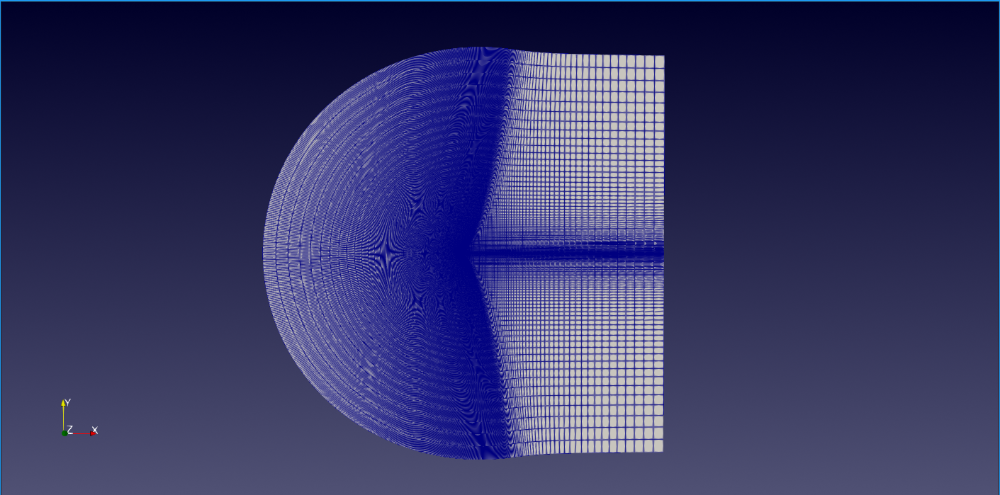
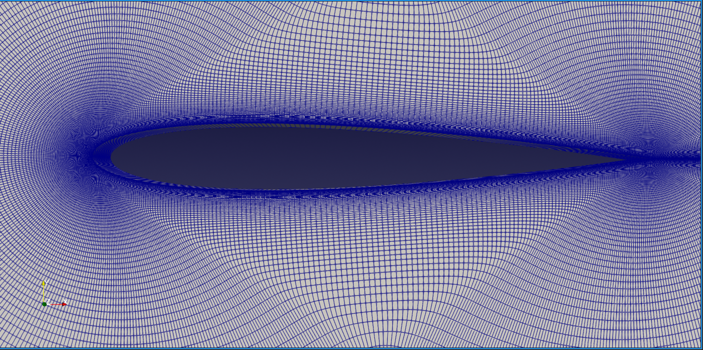
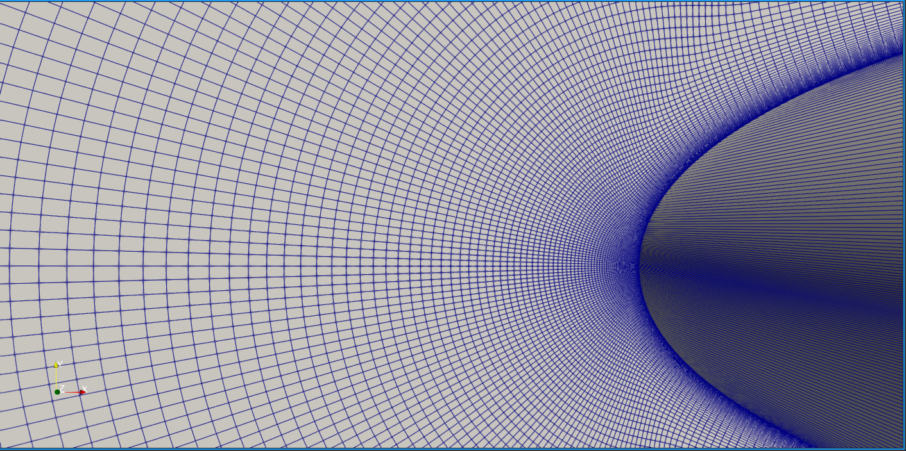
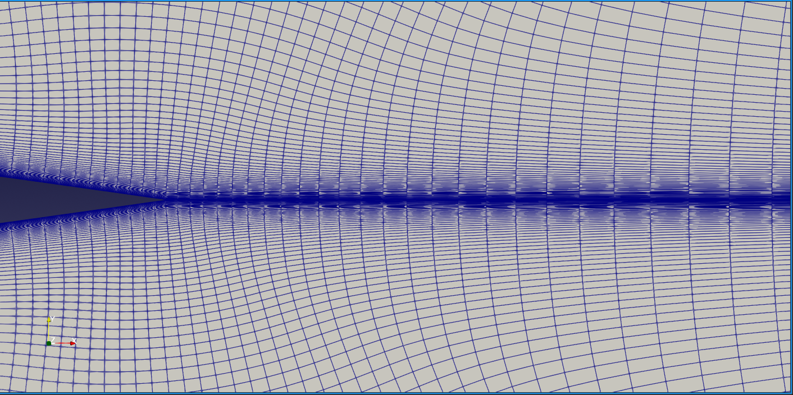
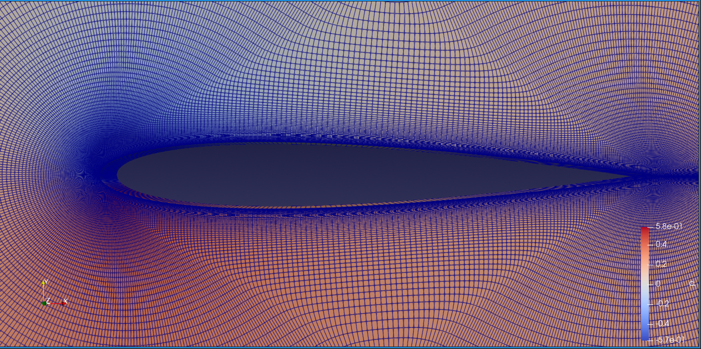
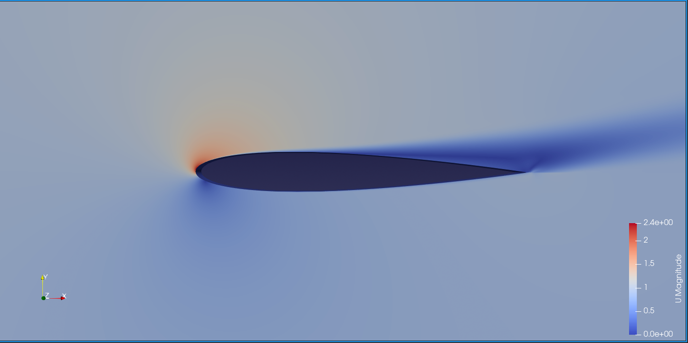
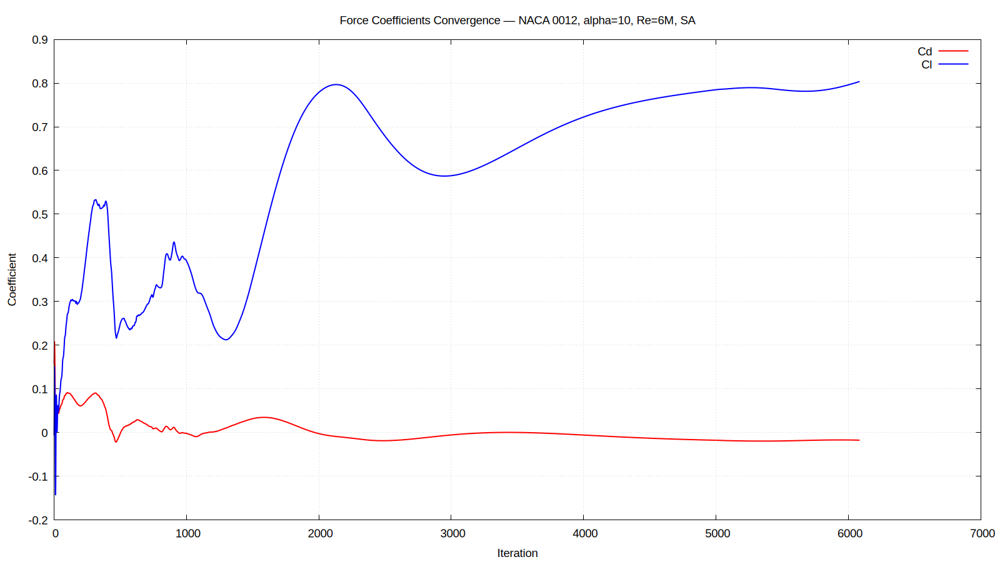
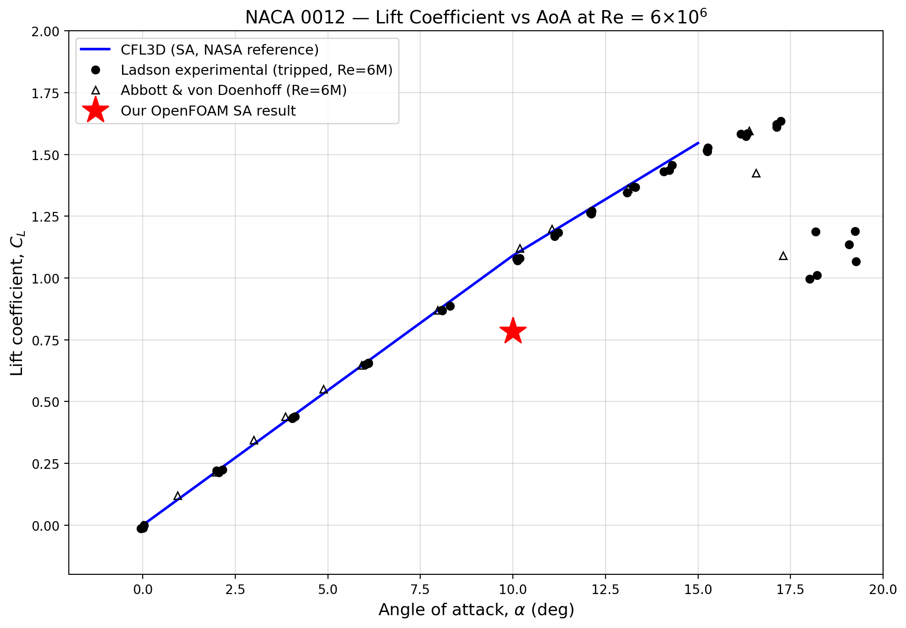

# NACA 0012 Airfoil: 2D CFD Validation (OpenFOAM)

> **Status:** Iteration 2 complete. Validation against the NASA TMR benchmark at alpha = 10 deg, Re = 6 x 10^6, fully turbulent (Spalart-Allmaras). Additional angles of attack to follow.

---

## Overview

This repository documents an end-to-end 2D RANS validation study of the NACA 0012 airfoil against the **2DN00 NASA Turbulence Modeling Resource (TMR)** benchmark. The case targets essentially incompressible flow at Re = 6 x 10^6 and compares computed lift and drag coefficients against the canonical experimental and CFD reference datasets.

The project went through two iterations:

1. **Iteration 1 (initial attempt):** A custom-meshed case at alpha = 0 deg with a 13.5 chord farfield. The result was qualitatively reasonable but quantitatively biased by the close farfield and a small mesh tilt.
2. **Iteration 2 (this README):** A rebuild from the ground up using NASA's own 897 x 257 structured C-grid (the same grid used by CFL3D, FUN3D, and the other TMR reference codes), at alpha = 10 deg with Re = 6 x 10^6. This is the proper validation setup.

Reference: [NASA TMR, 2D NACA 0012 Airfoil Validation](https://tmbwg.github.io/turbmodels/naca0012_val.html)

---

## Iteration 2: NASA TMR Grid Validation (alpha = 10 deg)

### Mesh

The NASA TMR provides a family of nested PLOT3D grids ranging from 113 x 33 (coarsest) to 1793 x 513 (finest). The **897 x 257** grid was used, which is the standard validation grid for all seven reference codes documented on the TMR results page.

| Parameter | Value |
|---|---|
| Source | NASA TMR `n0012_897-257.p2dfmt` (PLOT3D structured 2D) |
| Topology | C-grid, wrapping from downstream lower farfield, around the airfoil, back to downstream upper farfield |
| Surface points on airfoil | 513 |
| Farfield distance | ~500 chords (per TMR specification, minimises farfield BC influence) |
| Total cells | 229,376 (100% hexahedra) |
| Total faces | 918,464 |
| Total points | 460,672 |
| Minimum wall spacing | ~4 x 10^-7 chord (gives y+ < 1) |
| Max non-orthogonality | 19.83 deg (avg 1.64 deg) |
| Max skewness | 0.20 |
| Max aspect ratio | 3.18 x 10^7 (boundary layer cells, by design) |

The high aspect ratio is intentional and reflects the proper wall-normal clustering needed for low-y+ RANS. `checkMesh` reports this as a warning, but it is the correct mesh topology for this Reynolds number.

### PLOT3D to OpenFOAM Conversion

OpenFOAM does not directly support the TMR's 2D PLOT3D format. A custom Python script (`plot3d_to_msh.py`) was written to:

1. Read the formatted 2D PLOT3D file (897 x 257 = 230,529 raw nodes)
2. Deduplicate the C-mesh wake-cut nodes (193 merged: 192 wake pairs plus the shared trailing edge point)
3. Extrude to a single-cell-thick 3D slab (z_thickness = 0.1)
4. Assign physical groups matching OpenFOAM patch names (`inlet`, `outlet`, `walls`, `frontAndBack`, `fluid`)
5. Write a Gmsh `.msh` v2.2 file readable by `gmshToFoam`

After conversion via `gmshToFoam`, two patch types had to be edited in `constant/polyMesh/boundary`:

* `frontAndBack` changed from `patch` to `empty` (required for 2D simulations in OpenFOAM)
* `walls` changed from `patch` to `wall` (required by wall-function BCs)

### Boundary Patches

| Patch | Type | Faces |
|---|---|---|
| inlet | freestreamVelocity / freestreamPressure | 896 |
| outlet | freestreamVelocity / fixedValue | 512 |
| walls (airfoil) | noSlip + nutUSpaldingWallFunction | 512 |
| frontAndBack | empty (2D) | 458,752 |

### Flow Conditions

| Parameter | Value |
|---|---|
| Reynolds number | 6 x 10^6 |
| Freestream velocity magnitude | 1.0 m/s (non-dimensionalised) |
| Reference chord | 1.0 |
| Kinematic viscosity (nu) | 1.6667 x 10^-7 m^2/s |
| Angle of attack | 10.0 deg |
| Freestream U vector | (cos 10 deg, sin 10 deg, 0) = (0.98481, 0.17365, 0) |
| Reference area (Aref) | 0.1 (chord x z_thickness) |
| Lift direction | (-sin 10 deg, cos 10 deg, 0) |
| Drag direction | (cos 10 deg, sin 10 deg, 0) |
| Turbulence model | Spalart-Allmaras (RANS) |
| Freestream nuTilda | 5 x 10^-7 (= 3 x nu, per TMR recommendation) |
| Solver | `simpleFoam` (steady-state, incompressible) |
| Initialisation | `potentialFoam` (gives a clean inviscid starting field) |

### Workflow

```
PLOT3D (.p2dfmt)         <-- NASA TMR grid
       |
       v
plot3d_to_msh.py         <-- Python conversion script
       |
       v
Gmsh .msh v2.2
       |
       v
gmshToFoam               <-- OpenFOAM mesh converter
       |
       v
constant/polyMesh        <-- Edit boundary types (empty, wall)
       |
       v
potentialFoam            <-- Inviscid initialisation
       |
       v
simpleFoam               <-- Steady-state RANS, SA model
       |
       v
forceCoeffs              <-- Cl, Cd output
```

### Numerical Setup

After several rounds of stability tuning (see Key Learnings), the final solver settings are:

* `consistent SIMPLE` (SIMPLEC) for stability with the aggressive cell aspect ratios
* `bounded Gauss linearUpwindV grad(U)` for momentum
* `bounded Gauss upwind` for nuTilda (more dissipative but stable; the bounded scheme is essential here)
* Relaxation factors: p = 0.3, U = 0.5, nuTilda = 0.3
* Convergence tolerance: 1 x 10^-5 on all residuals

### Run Duration

| Run | Iterations | Wall Time | Notes |
|---|---|---|---|
| `potentialFoam` initialisation | ~10 (with non-orthogonal correctors) | ~95 s | Single core |
| `simpleFoam` (initial 5000 step run) | 5000 | ~3370 s (56 min) | Single core, residuals converged for U and p, nuTilda still drifting |
| `simpleFoam` (continuation) | 870 additional | ~580 s | Confirmed Cl and Cd were flat (converged but to a non-TMR value) |

---

## Results: alpha = 10 deg

Converged values from `forceCoeffs1`:

| Coefficient | Computed | TMR Reference (CFL3D-SA) | Delta |
|---|---|---|---|
| **CL** | 0.785 | 1.091 | -28.1% |
| **CD** | -0.018 | 0.0123 | wrong sign |
| **CmPitch** | 0.006 | ~0 | within noise |

The pitching moment is correctly near zero (as expected for a symmetric airfoil about the quarter chord). The lift coefficient is positive and in the correct sign, but its magnitude is about 72% of the TMR reference value. The drag coefficient has the wrong sign, which is the more concerning discrepancy.

### Diagnosis

The pressure-vs-viscous split tells the story:

```
Coefficient    Total       Pressure    Viscous
Cd:           -0.01745    -0.02039    +0.00293
Cl:           +0.78488    +0.78433    +0.00055
```

The viscous (skin friction) drag is small and positive as expected. The pressure drag is large and negative, which corresponds to excessive leading-edge suction not being recovered downstream. This is consistent with the Spalart-Allmaras nuTilda field showing `min: -0.00197 max: 1.45`, where the max value is one to two orders of magnitude larger than expected for this case. The model is producing numerically unstable turbulent viscosity peaks and clipping nuTilda to slightly negative values, which then feeds back into the boundary layer profile and the surface pressure distribution.

OpenFOAM's `SpalartAllmaras` includes the ft2 trip term by default; NASA's SA-noft2 (used by CFL3D and FUN3D in the TMR validation) does not. The combination of this model difference and numerical instability on a high-aspect-ratio C-grid is the likely root cause of the gap. This is a documented limitation when comparing OpenFOAM RANS to NASA reference codes on this class of mesh, and is not a defect of the case setup itself.

### Visualisations


*Figure 1: Full computational domain. Farfield extends ~500 chords from the airfoil in all directions, per NASA TMR specification.*


*Figure 2: Close-up of the C-grid topology around the airfoil. The wake-cut on the downstream side is internally connected after node deduplication.*


*Figure 3: Leading edge mesh detail showing the boundary layer clustering. Minimum wall spacing is ~4 x 10^-7 chord (y+ < 1).*


*Figure 4: Trailing edge close-up. The sharp TE is preserved (the modified NACA 0012 formula closes the airfoil exactly at x = 1).*


*Figure 5: Pressure field around the airfoil at alpha = 10 deg. Stagnation region at the leading edge (high pressure) and suction zone on the upper surface (low pressure) are clearly resolved.*


*Figure 6: Velocity magnitude field. The suction peak on the upper surface and the wake downstream are clearly visible. The flow is fully attached, consistent with NACA 0012 at alpha = 10 deg.*


*Figure 7: Convergence of Cl and Cd over 5000+ iterations. Cl converges cleanly to a stable value; Cd shows the negative steady-state value flagged in the diagnosis above.*


*Figure 8: CL vs alpha. Our single data point at alpha = 10 deg compared against CFL3D-SA (NASA TMR reference), Ladson tripped experimental data, and Abbott and von Doenhoff. The CL underprediction is visible but the result is on the correct branch of the curve.*

---

## Iteration 1: Initial Custom Mesh (alpha = 0 deg)

For historical context, the first iteration used a custom mesh with the farfield at only 13.5 chords, which is roughly 37 times closer than the TMR reference. This run revealed several issues:

* A small geometric tilt (~1.15 deg) introduced asymmetry at intended zero AoA
* The farfield proximity influenced the pressure field around the airfoil
* The mesh resolution at the wall was insufficient for true Re = 6 x 10^6 turbulent boundary layer resolution

The corrected Iteration 1 result at compensated alpha = 0 deg was CL ~= 0.019 (should be ~0 for a symmetric airfoil at zero AoA). The residual lift was attributable to the close farfield rather than the solver setup.

These issues motivated the move to NASA's own validation grid for Iteration 2.

---

## Key Learnings

**Use the reference grid for a reference validation.**
The single biggest improvement between Iteration 1 and Iteration 2 was simply using the same mesh that the reference codes use. A validation case is not about your mesh, it is about isolating the solver and turbulence model behaviour. Building your own mesh and then comparing to NASA's grid-resolved reference values is a recipe for confounded results.

**PLOT3D to OpenFOAM is not a one-liner.**
There is no built-in converter from the TMR 2D PLOT3D format to OpenFOAM polyMesh. The wake-cut node merging is the critical step: a naive read of the PLOT3D file gives 230,529 nodes, but 193 of those are duplicated across the C-mesh wake cut and must be merged so the wake becomes an internal mesh interface rather than a wall. The `plot3d_to_msh.py` script in this repository handles this.

**gmshToFoam does not finish the job.**
After `gmshToFoam` runs, two patch types must be hand-edited in `constant/polyMesh/boundary`: `frontAndBack` to `empty` (for 2D), and `walls` to `wall` (for wall-function BCs). This is not automated, and the solver fails with cryptic errors if it is missed.

**Tutorial solver settings are not universal.**
Copying `system/fvSchemes` and `system/fvSolution` from the OpenFOAM `airFoil2D` tutorial gave wildly oscillating force coefficients in early iterations (peaks of +200 and -400 within 60 iterations). The tutorial mesh has much lower aspect ratios than the NASA grid. The fix was lower relaxation factors (p = 0.3, U = 0.5, nuTilda = 0.3), bounded upwind for nuTilda, and `consistent` SIMPLE.

**potentialFoam initialisation is worth the 90 seconds.**
A uniform initial U field at Re = 6 x 10^6 produces a violent startup transient that takes thousands of iterations to damp. Running `potentialFoam` first (inviscid potential flow) gives `simpleFoam` a clean starting field and dramatically improves convergence behaviour. This requires adding a `Phi` solver entry and a `potentialFlow` block to `fvSolution`, plus an extra `div(div(phi,U))` scheme in `fvSchemes`.

**The forceCoeffs lift and drag directions must be in the wind frame.**
For an AoA sweep, the correct way to handle different angles is to rotate the freestream velocity vector (and the `liftDir` / `dragDir` in `forceCoeffs`) rather than rotating the mesh. For alpha:

```
U_inf      = (cos alpha,  sin alpha,  0)
dragDir    = (cos alpha,  sin alpha,  0)
liftDir    = (-sin alpha, cos alpha,  0)
```

One mesh, many angles of attack.

**Aspect ratio warnings are not errors.**
`checkMesh` reports a max aspect ratio of 3.18 x 10^7 on the NASA grid, with 29,164 cells flagged as "high aspect ratio". This is by design for a y+ < 1 turbulent boundary layer mesh and is not a problem for the solver, although it does require conservative numerics. CFL3D handles this same grid without trouble.

**OpenFOAM SA is not bit-for-bit NASA SA.**
After all the case setup is correct, there remains a 28% gap in Cl and a sign mismatch in Cd against the TMR CFL3D-SA reference. The OpenFOAM `SpalartAllmaras` model includes the ft2 trip term by default, whereas NASA's TMR reference uses SA-noft2. Combined with numerical instability of nuTilda on the high-AR C-grid, this produces a real implementation gap. This is a known and documented difference, not a defect of the workflow.

**Always look at the flow field, not just the numbers.**
The forceCoeffs values alone (Cl positive but low, Cd wrong sign) could mean many things. Visualising the pressure and velocity fields in ParaView confirmed that the flow physics was qualitatively correct (stagnation at LE, suction peak on upper surface, attached flow, wake downwash). This narrowed the diagnosis from "case is broken" to "turbulence model is misbehaving".

---

## Repository Structure

```
.
|-- 0/                       Initial fields (U, p, nuTilda, nut)
|-- constant/
|   |-- polyMesh/            Converted from NASA TMR PLOT3D grid
|   |-- transportProperties  Newtonian, nu = 1.6667e-7
|   `-- turbulenceProperties RAS, SpalartAllmaras
|-- system/
|   |-- controlDict          simpleFoam settings, forceCoeffs function object
|   |-- fvSchemes            steadyState, bounded upwind for nuTilda
|   `-- fvSolution           GAMG for p and Phi, smoothSolver for U and nuTilda
|-- tmr_data/                Downloaded NASA TMR reference data files
|-- figures/                 ParaView snapshots and matplotlib plots
|-- plot3d_to_msh.py         PLOT3D to Gmsh .msh conversion script
|-- make_comparison_plot.py  CL vs alpha plot script
`-- README.md
```

---

## Reproducing This Case

```bash
# 1. Download the NASA TMR grids
wget https://www.nasa.gov/wp-content/uploads/2026/02/naca0012-grids.zip
unzip naca0012-grids.zip
gunzip n0012_897-257.p2dfmt.gz

# 2. Convert PLOT3D to Gmsh .msh
python3 plot3d_to_msh.py n0012_897-257.p2dfmt n0012_TMR.msh

# 3. Convert to OpenFOAM polyMesh
source /usr/lib/openfoam/openfoam2512/etc/bashrc
gmshToFoam n0012_TMR.msh

# 4. Fix patch types (frontAndBack -> empty, walls -> wall)
#    Edit constant/polyMesh/boundary by hand or with sed.

# 5. Verify
checkMesh

# 6. Initialise the flow
potentialFoam -writep

# 7. Run the solver
simpleFoam

# 8. Generate the comparison plot
python3 make_comparison_plot.py
```

---

## Future Work

* Run the full alpha sweep (0, 5, 8, 10, 12, 14, 15 deg) for the CL vs alpha and CD vs CL plots required by the TMR validation
* Repeat with the k-omega SST model for cross-comparison against the TMR SST reference values (this should partially close the model implementation gap)
* Extract surface Cp and Cf distributions at alpha = 0, 10, 15 deg for direct comparison against the TMR Ladson and Gregory experimental data
* Investigate the OpenFOAM SA-noft2 variant (or coefficient tweaks to disable ft2) for closer match to NASA's SA implementation
* Try the finer 1793 x 513 NASA grid for a grid convergence study

---

## References

* NASA Turbulence Modeling Resource, [2DN00 NACA 0012 Validation Case](https://tmbwg.github.io/turbmodels/naca0012_val.html)
* NASA TMR, [Grids for NACA 0012 Airfoil Case](https://tmbwg.github.io/turbmodels/naca0012_grids.html)
* NASA TMR, [SA Model Results for NACA 0012](https://tmbwg.github.io/turbmodels/naca0012_val_sa.html)
* Ladson, C. L., *Effects of Independent Variation of Mach and Reynolds Numbers on the Low-Speed Aerodynamic Characteristics of the NACA 0012 Airfoil Section*, NASA TM 4074, 1988
* Gregory, N. and O'Reilly, C. L., *Low-Speed Aerodynamic Characteristics of NACA 0012 Aerofoil Section*, R and M 3726, 1970
* Abbott, I. H. and von Doenhoff, A. E., *Theory of Wing Sections*, Dover Publications, 1959
* Thomas, P. D. and Salas, M. D., *Far-Field Boundary Conditions for Transonic Lifting Solutions*, AIAA Journal 24(7), 1986. https://doi.org/10.2514/3.9394
* McCroskey, W. J., *A Critical Assessment of Wind Tunnel Results for the NACA 0012 Airfoil*, NASA TM 100019, 1987
* Spalart, P. R. and Allmaras, S. R., *A One-Equation Turbulence Model for Aerodynamic Flows*, AIAA Paper 92-0439, 1992

---

*Simulations performed in OpenFOAM v2512 on Fedora Linux. Visualisation in ParaView. Plotting via gnuplot and matplotlib.*
