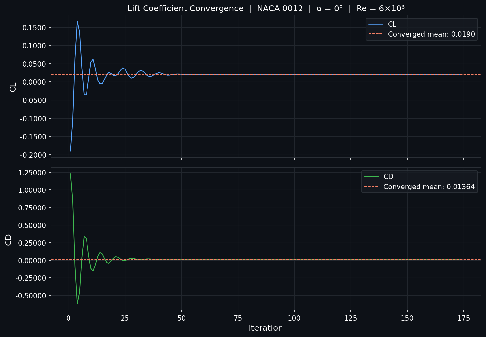
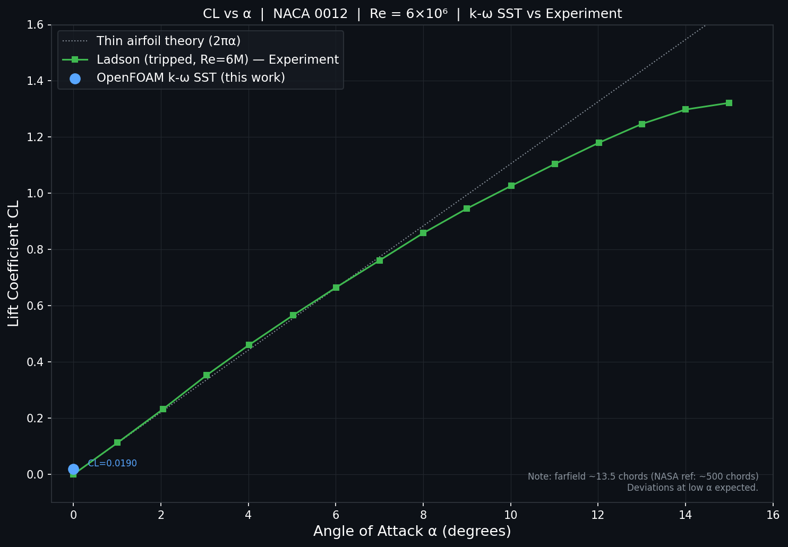
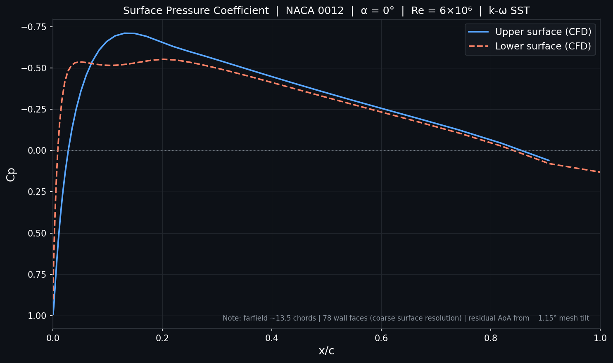
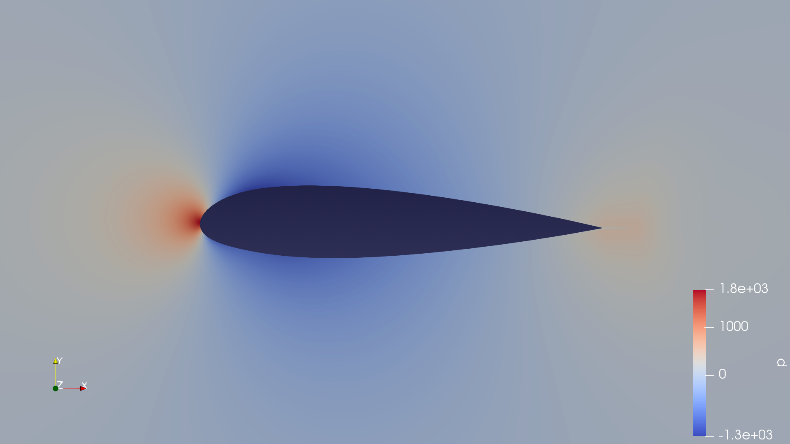
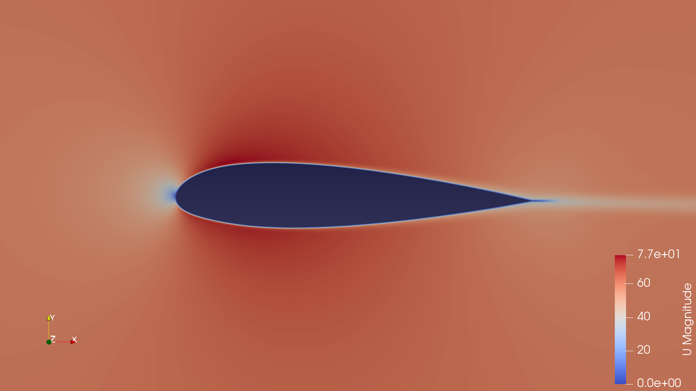

# NACA 0012 Airfoil -> 2D CFD Validation (OpenFOAM)

> **Status:** Work in progress -> α = 0° complete, more angles of attack to follow.

---

## Overview

This case replicates the **2DN00 NACA 0012 Airfoil Validation** benchmark defined by the NASA Turbulence Modeling Resource (TMR), targeting Re = 6 × 10⁶ under essentially incompressible conditions. The goal is to validate lift and drag coefficients against established experimental datasets and build toward a full α-sweep covering multiple angles of attack.

Reference: [NASA TMR — 2D NACA 0012 Airfoil Validation](https://tmbwg.github.io/turbmodels/naca0012_val.html)

---

## Case Setup

### Geometry & Airfoil Definition

The NACA 0012 profile used by NASA TMR is a slightly modified version of the classic definition, scaled so that the trailing edge closes sharply at chord = 1. The revised formula is:

```
y = ± 0.594689181 × [0.298222773√x − 0.127125232x − 0.357907906x² + 0.291984971x³ − 0.105174606x⁴]
```

In this simulation the chord length is **35 units**, measured using the ruler tool in ParaView.

### Mesh

| Parameter | Value |
|---|---|
| Mesh generator | Converted from pre-existing geometry (PolyMesh format, no blockMeshDict) |
| Cell type | Hexahedral (100% hex, 0 polyhedra) |
| Total cells | 10,720 |
| Total faces | 43,066 |
| Total points | 21,812 |
| Domain extent | ≈ −237.5 to 236.3 (x), −222.65 to 223.7 (y) |
| Farfield distance | ~13.5 chords from airfoil |
| Max non-orthogonality | 41.6° (average 7.5°) |
| Max skewness | 0.983 |
| Max aspect ratio | 98.8 |

**Note on farfield distance:** The NASA reference grids place the farfield boundary ~500 chords away, which minimises the influence of farfield boundary conditions on lift and drag. This case uses ~13.5 chords, which is a known source of deviation in the computed CL values compared to the experimental data. This will be addressed in future iterations.

### Boundary Patches

| Patch | Type | Faces |
|---|---|---|
| inlet | Velocity inlet | 134 |
| outlet | Pressure outlet | 160 |
| walls (airfoil) | No-slip wall | 78 |
| frontAndBack | Empty (2D) | 21,440 |

### Flow Conditions

| Parameter | Value |
|---|---|
| Reynolds number | 6 × 10⁶ |
| Freestream velocity (U∞) | 60 m/s |
| Reference length (chord) | 35 units |
| Kinematic viscosity (ν) | 3.5 × 10⁻⁴ m²/s |
| Reference area (Aref) | 1.75 m² |
| Solver | `simpleFoam` (steady-state, incompressible) |
| Turbulence model | k-ω SST |

The kinematic viscosity was back-calculated from Re = U∞ × c / ν to match the target Reynolds number exactly.

---

## Run History

### Run 1 -> Initial attempt (α = 0°)

The first run revealed a **geometric tilt of ~1.15°** in the imported mesh. This introduced a non-zero angle of attack even though the intended case was α = 0°, producing asymmetric lift results.

### Run 2 -> Corrected (α = 0°)

To correct for the tilt without remeshing, the freestream velocity components were decomposed to compensate:

```
Ux = U∞ × cos(1.15°)
Uy = U∞ × sin(1.15°)   ← adjusted to cancel geometric offset
```

This brought the effective angle of attack back to 0° and yielded physically consistent results.

---

## Results -> α = 0°

Converged values (averaged over the final steady iterations):

| Coefficient | Computed value |
|---|---|
| **CL** | ~0.019 |
| **CD** | ~0.0136 |
| CmPitch | ~−3.62 × 10⁻³ |

### Convergence

The simulation ran for **174 time steps** with simpleFoam. The force coefficients show clear convergence toward the end of the run -> early iterations exhibit large transients (characteristic of RANS startup), settling into a stable band beyond ~iteration 50.


*Figure 1: CL vs. iteration number showing convergence to steady state.*

### Comparison with Experimental Data

For α = 0°, the NASA TMR benchmark reports the following from the **Ladson tripped dataset** (most appropriate for fully turbulent CFD at Re = 6 × 10⁶):

| Source | CL (α = 0°) |
|---|---|
| Ladson (tripped, Re = 6M) | ~0.00 (symmetric airfoil at 0°) |
| This simulation | ~0.019 |

At α = 0° a symmetric airfoil should theoretically produce CL ≈ 0. The small positive CL computed here is consistent with the residual effect of the farfield proximity (~13.5 chords vs. the reference ~500 chords) and any minor numerical asymmetries in the mesh. This is expected and documented.


*Figure 2: CL vs. α -> simulation vs. Ladson experimental data. To be populated as more angles of attack are added.*


*Figure 3: Surface pressure coefficient (Cp) distribution at α = 0°.*


*Figure 4: Pressure field around the NACA 0012 at α = 0° visualised in ParaView.*


*Figure 5: Velocity magnitude field around the NACA 0012 at α = 0°.*

---

## Key Learnings

**Chord measurement via ParaView ruler**
The chord length (35 units) was determined directly from the mesh geometry using the ParaView ruler filter, rather than relying on mesh generation parameters. This is the correct approach when working with converted meshes that lack an explicit blockMeshDict.

**Reynolds number -> flow condition derivation**
Given Re, c, and a chosen U∞, kinematic viscosity is derived as ν = U∞ × c / Re. This sets the transport properties in `constant/transportProperties`.

**Geometric tilt correction via velocity decomposition**
Rather than remeshing, the 1.15° tilt was corrected by decomposing the inlet velocity into components. This is a practical technique when the mesh cannot be easily rotated.

**Farfield distance matters for CL accuracy**
The NASA reference places boundaries ~500 chords away. At ~13.5 chords the farfield boundary condition actively influences the pressure field around the airfoil, shifting computed CL. A farfield vortex correction (Thomas & Salas, 1986) can partially compensate, and will be explored in future runs.

**Understanding CL and Cp**
CL is the integrated effect of the pressure and friction distributions over the entire surface. Cp = (p − p∞) / (½ρU∞²) describes the local pressure distribution and is the more fundamental quantity -> integrating Cp over the chord recovers CL.

---

## Repository Structure

```
.
├── 0/                  # Initial conditions (U, p, k, omega, nut)
├── constant/           # Mesh (polyMesh/) and transport properties
├── system/             # controlDict, fvSchemes, fvSolution, forceCoeffs
├── postProcessing/     # Force coefficient output (coefficient.dat)
├── figures/            # ParaView screenshots and plots (to be added)
└── README.md
```

---

## References

- NASA Turbulence Modeling Resource — [2DN00 NACA 0012 Validation Case](https://tmbwg.github.io/turbmodels/naca0012_val.html)
- Ladson, C. L., *Effects of Independent Variation of Mach and Reynolds Numbers on the Low-Speed Aerodynamic Characteristics of the NACA 0012 Airfoil Section*, NASA TM 4074, 1988
- Gregory, N. & O'Reilly, C. L., *Low-Speed Aerodynamic Characteristics of NACA 0012 Aerofoil Section*, R&M 3726, 1970
- Abbott, I. H. & von Doenhoff, A. E., *Theory of Wing Sections*, Dover Publications, 1959
- Thomas, P. D. & Salas, M. D., *Far-Field Boundary Conditions for Transonic Lifting Solutions*, AIAA Journal 24(7), 1986. https://doi.org/10.2514/3.9394
- McCroskey, W. J., *A Critical Assessment of Wind Tunnel Results for the NACA 0012 Airfoil*, NASA TM 100019, 1987

---

*Simulations performed in OpenFOAM v2512 on Fedora Linux. Visualisation in ParaView.*
