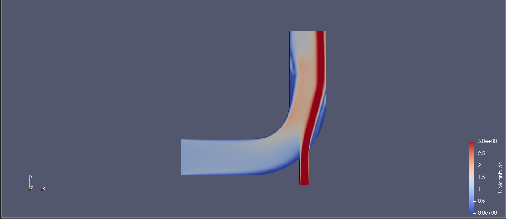
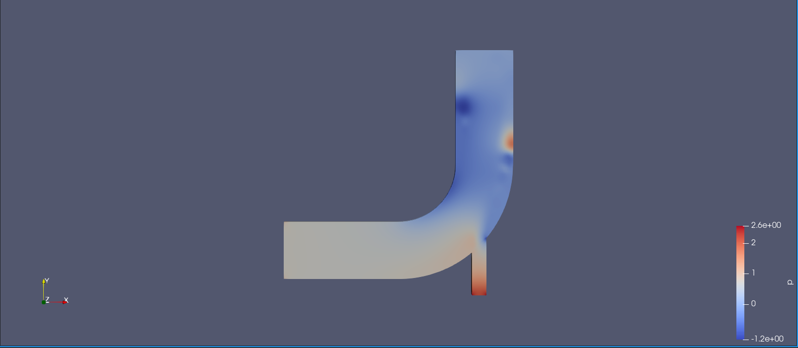

# Flow Through a Pipe Elbow OpenFOAM Simulation

A computational fluid dynamics simulation of incompressible viscous flow through a 90° pipe elbow with two inlets, solved using OpenFOAM v2512 on Fedora Linux. This case is based on the official OpenFOAM introductory tutorial and was used to develop familiarity with the full CFD workflow  meshing, solver configuration, execution, and post-processing in ParaView.


## Case Overview

 Parameter | Value 

| Solver | `icoFoam` (transient, incompressible, laminar) |
| Simulation Duration | 75 seconds |
| Kinematic Viscosity (ν) | 0.01 m²/s |
| Inlet 1 (horizontal, x-direction) | 1 m/s |
| Inlet 2 (vertical, y-direction) | 3 m/s |
| Outlet | Zero-gradient pressure condition |
| Walls | No-slip boundary condition |

The fluid properties represent a high-viscosity incompressible fluid, which keeps the flow in the laminar regime and makes the simulation numerically stable  appropriate for an introductory case studying the fundamental behaviour of flow at a bend.


## Geometry & Boundary Conditions

The domain is a 2D pipe elbow (extruded in the z-direction with `frontAndBackPlanes` set to `empty`), consisting of:

- A horizontal inlet feeding flow in the +x direction at **1 m/s**
- A vertical inlet feeding flow in the +y direction at **3 m/s**
- A single outlet with a zero-gradient pressure boundary
- No-slip walls on all pipe surfaces

The two inlet streams meet at the elbow junction, creating a combined flow that navigates the 90° bend making the velocity and pressure fields richer and more asymmetric than a single-inlet case.

---

## Physics: What This Simulation Shows

### Velocity Distribution
When fluid rounds the bend, inertia resists the change in direction. The faster-moving core fluid is thrown toward the **outer wall** of the elbow, producing a high-velocity region there. Near the **inner corner**, the flow cannot cleanly follow the geometry  it partially separates from the wall, creating a slow-moving recirculation zone.

With two inlet streams at different velocities (1 m/s horizontal, 3 m/s vertical), the stronger vertical inlet dominates the combined flow direction, creating visible asymmetry in the velocity field at the junction before the flow settles downstream.

### Pressure Distribution
A high-pressure zone develops at the **outer wall** of the bend  the direct impact point of the inertia-driven flow. The inner corner correspondingly shows lower pressure. This pressure differential is the mechanism that forces the fluid around the bend, and in real engineering systems it governs structural loading and erosion patterns at pipe fittings.

### Flow Recovery
After the bend, the velocity profile gradually re-develops toward a more uniform distribution. The length required for this recovery  the *reattachment length*  is visible in the simulation and is a practically relevant quantity in pipe system design.


## Results

| Velocity Magnitude | Pressure Field |
|---|---|
|  |  |


## File Structure
```
elbow/
├── 0/                  # Initial and boundary conditions
│   ├── U               # Velocity field (two inlet BCs defined here)
│   └── p               # Pressure field
├── constant/
│   ├── polyMesh/       # Mesh generated by blockMesh
│   └── transportProperties  # Kinematic viscosity (nu = 0.01)
├── system/
│   ├── controlDict     # Solver settings, endTime = 75s
│   ├── fvSchemes       # Numerical discretisation schemes
│   └── fvSolution      # Linear solver settings and tolerances
├── images/             # ParaView result screenshots
└── README.md
```

---

## How to Run

**Prerequisites:** OpenFOAM v2512 installed and sourced
```bash
# Navigate to case directory
cd elbow

# Generate the mesh
blockMesh

# Run the solver
icoFoam

# Post-process in ParaView
paraFoam
```

---

## Tools Used

| Tool | Purpose |
|---|---|
| OpenFOAM v2512 | Solver and case management |
| `blockMesh` | Structured mesh generation |
| `icoFoam` | Transient incompressible Navier-Stokes solver |
| ParaView | Post-processing and visualisation |
| Fedora Linux | Operating environment |


## Key Learnings

- Configured and ran a complete OpenFOAM case from scratch on Linux, including mesh generation, solver execution, and post-processing
- Understood the physical role of each boundary condition  no-slip walls, fixed velocity inlets, zero-gradient outlet 
- Observed and interpreted inertia-driven flow asymmetry, outer-wall pressure buildup, and inner-corner separation at a pipe bend
- Developed familiarity with OpenFOAM's case file structure (`0/`, `constant/`, `system/`) and the finite-volume workflow
- Used ParaView to extract and interpret velocity and pressure fields from simulation output


## References

- [OpenFOAM Official Documentation](https://www.openfoam.com/documentation)
- OpenFOAM v2512 Tutorial Cases — `$FOAM_TUTORIALS/incompressible/icoFoam/elbow`
