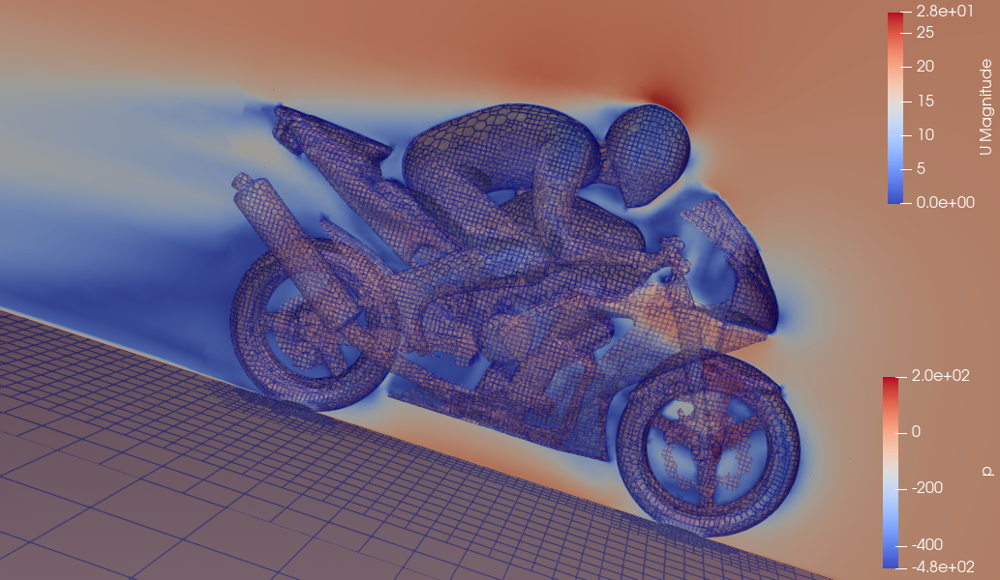

# MotorBike External Aerodynamics -> OpenFOAM 2512

External aerodynamics simulation of a motorbike and rider geometry using **snappyHexMesh** for meshing and **simpleFoam** for steady-state RANS solving. This is the standard OpenFOAM motorBike tutorial, run and documented as part of learning the full CFD pipeline from geometry to results.

---

## Case Summary

| Parameter | Value |
|---|---|
| Solver | simpleFoam (steady-state incompressible) |
| Mesher | snappyHexMesh |
| Turbulence model | k-omega SST (RANS) |
| Final mesh size | ~353,578 cells |
| Iterations | 500 |
| Platform | OpenFOAM v2512, Fedora Linux |

---

## What This Case Taught

### 1. Why blockMesh comes first

snappyHexMesh is not a standalone mesher it is a refinement tool. It needs an existing structured Cartesian hex mesh to start from. `blockMesh` creates that background mesh: a large rectangular domain (the "wind tunnel") filled with ~1,280 coarse uniform hex cells. The motorbike geometry sits entirely inside this box.

snappyHexMesh then takes this coarse canvas and progressively refines it toward the geometry surface -> shrinking cells, removing cells inside the solid, and snapping the remaining cells to the surface.

Without the blockMesh background, snappyHexMesh has nothing to work with.

### 2. surfaceFeatureExtract -> edge detection before meshing

Before meshing, OpenFOAM needs to know where the **sharp edges** are on the geometry -> wheel rims, fairing edges, handlebar ends. These are edges where adjacent surface patches meet at an angle sharper than a defined threshold (`includedAngle 150` in this case).

`surfaceFeatureExtract` reads the `.obj` geometry file and outputs a `.eMesh` file containing these feature edges. During the snapping stage, snappyHexMesh uses this file to align mesh edges precisely with the geometry's sharp features preventing the mesh from smoothing over edges that should stay sharp.

Physically this matters because sharp edges govern flow separation and vortex generation. A mesh that smooths over them will predict the wrong pressure distribution and drag.

### 3. snappyHexMesh -> three-stage pipeline

snappyHexMesh transforms the background mesh in three sequential stages:

| Stage | Name | What happens |
|---|---|---|
| 1 | Castellated mesh | Cells near the geometry are refined. Cells inside the solid are removed. Result is a staircase approximation of the surface. |
| 2 | Snapping | Cell vertices are moved from staircase positions onto the actual curved geometry surface. The staircase artifacts are eliminated. |
| 3 | Layer addition | Thin prismatic cell layers are inserted between the snapped mesh and the wall surface, resolving the boundary layer. |

Refinement is not uniform -> the `snappyHexMeshDict` specifies higher refinement levels on the bike surface (levels 5–6) and moderate refinement in a downstream box region (level 4) to capture the wake. Each refinement level halves the cell size.

### 4. simpleFoam -> what it is actually solving

`simpleFoam` solves the steady-state incompressible Reynolds-Averaged Navier-Stokes (RANS) equations using the SIMPLE algorithm:

**Continuity:** `∇ · U = 0`

**Momentum:** `∇ · (UU) = -∇p + ∇ · (νeff ∇U)`

The RANS averaging introduces the Reynolds stress tensor, closed here by the **k-omega SST** two-equation turbulence model -> the standard choice for external aerodynamics because it handles both attached and mildly separated flows.

The output timestep folders (`100`, `200`, `300`, `400`, `500`) are **iteration numbers, not seconds**. This is a steady-state solver -> there is no time evolution. The solver iterates toward a single converged solution representing the time-averaged flow field.

---

## Full Command Sequence

```bash
# Restore initial conditions (Allclean deletes the 0/ folder)
cp -r 0.orig 0

# Extract feature edges from the geometry
surfaceFeatureExtract

# Generate background hex mesh
blockMesh

# Refine and snap mesh to the motorbike geometry
snappyHexMesh -overwrite

# Run the steady-state RANS solver
simpleFoam 2>&1 | tee log.simpleFoam
```

> All commands must be run from the **case root** -> the directory containing `0/`, `constant/`, and `system/` as direct children.

---

## Case Directory Structure

```
motorBike/
├── 0.orig/                         <- original initial conditions (never modified)
├── 0/                              <- working copy restored from 0.orig before each run
├── constant/
│   ├── triSurface/
│   │   └── motorBike.obj           <- geometry file (copied from FOAM_TUTORIALS/resources)
│   ├── extendedFeatureEdgeMesh/
│   │   └── motorBike.eMesh         <- output of surfaceFeatureExtract
│   └── polyMesh/                   <- mesh files written by snappyHexMesh
├── system/
│   ├── controlDict                 <- solver settings, output frequency
│   ├── blockMeshDict               <- background domain definition
│   ├── snappyHexMeshDict           <- refinement levels and snapping settings
│   ├── surfaceFeatureExtractDict   <- feature edge extraction settings
│   ├── fvSchemes                   <- numerical discretization schemes
│   └── fvSolution                  <- linear solver tolerances
├── 100/ -> 500/                     <- solver output at each saved iteration
└── postProcessing/                 <- force coefficients and other function objects
```
## Results

### Velocity Streamlines  


---

## Boundary Conditions

| Patch | Type | Physical meaning |
|---|---|---|
| inlet | fixedValue (U), zeroGradient (p) | Uniform freestream velocity entering the domain |
| outlet | zeroGradient (U), fixedValue (p) | Flow exits freely, pressure fixed at reference |
| motorBike | noSlip wall | Zero velocity at the surface |
| top / sides | slip | Free tangential flow, no normal velocity |
| ground | noSlip wall | Road surface |

---

## Errors Encountered

**Running from wrong directory**
```
FOAM FATAL ERROR: cannot find file .../constant/system/controlDict
```
Caused by running `surfaceFeatureExtract` from inside `constant/` instead of the case root. Fix: always `cd` to case root first.

**Missing triSurface directory**
```
FOAM FATAL ERROR: No surfaces specified/found for entry: motorBike.obj
```
The geometry file must be manually copied from the OpenFOAM resources directory:
```bash
mkdir -p constant/triSurface
cp $FOAM_TUTORIALS/resources/geometry/motorBike.obj.gz constant/triSurface/
gunzip constant/triSurface/motorBike.obj.gz
```

**MPI not in PATH (Fedora)**
```
mpirun: command not found
```
Fix:
```bash
sudo dnf install openmpi openmpi-devel
echo "module load mpi/openmpi-x86_64" >> ~/.bashrc
source ~/.bashrc
```

**ParaView reading snappyHexMesh stage folders as results**
```
vtkOpenFOAMReader: Number of cells/points do not match: mesh=353578, field=1280
```
Folders `1/`, `2/`, `3/` are snappyHexMesh intermediate outputs, not flow results. Move them out before opening in ParaView:
```bash
mkdir snappy_mesh_stages && mv 1 2 3 snappy_mesh_stages/
```

---

## Visualisation in ParaView

```bash
touch motorBike.foam
paraFoam
```

1. Open `motorBike.foam` -> Apply
2. Jump to timestep **500** using the time controls toolbar
3. Dropdown -> select `p` for pressure or `U` for velocity magnitude
4. For streamlines: **Filters -> Common -> Stream Tracer** with seed points upstream of the bike

---

## Next Steps

- [ ] Run `checkMesh` and interpret mesh quality metrics (max non-orthogonality, max skewness)
- [ ] Understand residual convergence -> what values indicate a well-converged solution
- [ ] Modify refinement levels in `snappyHexMeshDict` and observe the effect on cell count and mesh quality
- [ ] Build a snappyHexMesh case from scratch on a different geometry (NACA airfoil or simplified car body)

---

## References

- [OpenFOAM User Guide — snappyHexMesh](https://www.openfoam.com/documentation/user-guide/4-mesh-generation-and-conversion/4.4-mesh-generation-with-the-snappyhexmesh-utility)
- [OpenFOAM Wiki — snappyHexMesh](https://openfoamwiki.net/index.php/SnappyHexMesh)
- [Jozsef Nagy — OpenFOAM YouTube tutorials](https://www.youtube.com/@OpenFOAMJozsefNagy)
- [ENCCS OpenFOAM hands-on walkthrough](https://enccs.github.io/openfoam/2.02_openfoam-handson/)
